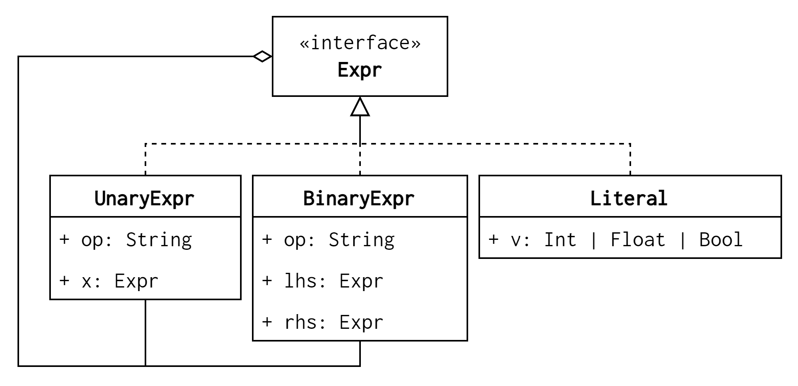

# 动机

思考一下，如果你需要根据参数的类型，选择合适的行为，会如何做？

整篇文章会以对 AST 进行求值举例，其中 AST 定义如下：

```python
import abc
from typing import Union

LiteralValueType = Union[int, float, bool]

class Expr(abc.ABC):
    pass

class Literal(Expr):
    def __init__(self, value: LiteralValueType):
        self.value = value

class UnaryExpr(Expr):
    def __init__(self, op: str, x: Expr):
        self.op = op
        self.x = x

class BinaryExpr(Expr):
    def __init__(self, lhs: Expr, rhs: Expr, op: str):
        self.lhs = lhs
        self.rhs = rhs
        self.op = op
```

一种非常容易想到的方式是利用反射机制：

```python
# The code requires Python 3.10 and above
def my_eval(e: Expr) -> LiteralValueType:
    def _eval_unary(op, x) -> LiteralValueType:
        match op:
            case "-":   return x
            case "not": return not x
            case _    : raise Exception("unsupported unary operator: {}".format(op))

    def _eval_binary(op, lhs, rhs) -> LiteralValueType:
        match op:
            case "+":   return lhs + rhs
            case "-":   return lhs - rhs
            case "*":   return lhs * rhs
            case "/":   return lhs / rhs
            case "and": return lhs and rhs
            case "or":  return lhs or rhs
            case _:     raise Exception("unsupported binary operator: {}".format(op))

    match type(e):
        case Literal:    return e.value
        case UnaryExpr:  return _eval_unary(e.op, my_eval(e.x))
        case BinaryExpr: return _eval_binary(e.op, my_eval(e.lhs), my_eval(e.rhs))
        case _:          raise Exception("unknown expression type: {}".format(type(e)))
```

这种方式的优点在于非常明确，但是缺点如下：
+ 在不支持反射的语言中（例如，C 和 C++），这种方式很难实现（当然，在 C++ 中你可以用 `dynamic_cast`；对于 C，我能想到的一种补救方式是每个 `struct` 关联一个标签，不过既容易出错，又会增加运行期开销，属于雪上加霜）
+ 缺少可扩展性。一方面，如果增加新的节点类型，就需要在 `my_eval` 函数中增加相应的分支；另一方面，如果想要支持对 AST 的其他操作，完全没有可以复用的内容

> 关于反射的效率，参见 StackOverflow 的[这个问题](https://stackoverflow.com/questions/3377576/if-reflection-is-inefficient-when-is-it-most-appropriate)和[这个问题](https://softwareengineering.stackexchange.com/questions/143205/reflection-is-using-reflection-still-bad-or-slow-what-has-changed-with-ref)

这里的核心问题在于：在有 sub-typing 的情况下，如何根据运行期对象的实际类型进行派发，Visitor 模式很好地解决了这个问题。不过，在正式进入 Visitor 模式之前，我们需要先来了解一下静态派发（static dispatching）和动态派发（dynamic dispatching）。

> 可能会有些读者认为将求值的功能分散到各个 `*Expr` 中更好：
>
> ```python
> class Expr(abc.ABC):
>    @abc.abstractmethod
>    def do_eval() -> LiteralValueType: pass
>
> class Literal(Expr):
>    def do_eval(self):
>        return self.value
>
> class UnaryExpr(Expr):
>    def do_eval(self):
>        match self.op:
>            case "-":   return -self.x.do_eval()
>            case "not": return not self.x.do_eval()
>            case _:     raise Exception()
>
> class BinaryExpr(Expr):
>     def do_eval(self):
>         match self.op:
>             pass
> ```
>
> 这样的设计有两个问题：
> + “求值”（至少我认为）不是 `*Expr` 的职责，`*Expr` 的职责是表示 AST 的数据结构，不符合单一职责原则
> + 假设将求值的功能放到了 `*Expr` 中，如果后续有其他需求（比如打印 AST），需要再次修改所有的 `*Expr`，这样不符合开闭原则

# 静态派发和动态派发

## 静态派发

所谓静态派发，就是根据编译期的声明类型选择合适的方法，例如：

```c++
using Time = int64_t;

class DateTimeFormatter {
 public:
  virtual std::string format(const Time &t) = 0;
  virtual ~DateTimeFormatter() {}
};

class StandardDateTimeFormatter : public DateTimeFormatter {
 public:
  std::string format(const Time &t) override {
    return "2006-01-02 15:04:05.006";
  }
  virtual ~StandardDateTimeFormatter() {}
};

class AmericanDateTimeFormatter : public DateTimeFormatter {
 public:
  std::string format(const Time &t) override {
    return "Jan. 02, 2006 - 15:04:05";
  }
  virtual ~AmericanDateTimeFormatter() {}
};
```

如果使用如下调用：

```c++
void foo(const DateTimeFormatter &f) {
  std::cout << "abstract" << std::endl;
}

void foo(const StandardDateTimeFormatter &f) {
  std::cout << "standard" << std::endl;
}

void foo(const AmericanDateTimeFormatter &f) {
  std::cout << "american" << std::endl;
}

int main() {
  std::cout << "name of formatter: ";
  std::string name;
  std::cin >> name;
  DateTimeFormatter *f;
  if (name == "standard") {
    f = new StandardDateTimeFormatter {};
  } else if (name == "american") {
    f = new AmericanDateTimeFormatter {};
  }
  foo(*f);

  delete f;
}
```

总是会打印 `abstract`，这是因为调用 `foo` 的哪个重载是在编译期确定的，而编译器唯一能够确切知道的信息就是 `f` 的类型为 `DateTimeFormatter`，所以就会选择第一个重载。

## 动态派发

与静态派发相反，动态派发是根据运行期的实际类型选择方法，例如：

```c++
int main() {
  std::cout << "name of formatter: ";
  std::string name;
  std::cin >> name;

  DateTimeFormatter *f;
  if (name == "standard") {
    f = new StandardDateTimeFormatter {};
  } else if (name == "american") {
    f = new AmericanDateTimeFormatter {};
  } else {
    std::abort();
  }
  f->format();

  delete f;
}
```

如果输入 `standard` 就会打印 `2006 ...`，如果输入 `american` 就会打印 `Jan ...`。

> 动态分派的实现机制参见[另一篇博文]({{ ref "/posts/how-dynamic-dispatching-works" }})

# Visitor 模式

回忆一下我们要解决的问题：在有 sub-typing 的情况下，如何根据运行期对象的实际类型进行派发。Visitor 模式的一个核心立足点是，对象自己最清楚自己的类型，由此，Visitor 模式解决这个问题的方式是：让对象自己选择调用哪个方法。

回到 AST 的例子，我们需要对 AST 做一些改造，给所有的 expression 增加一个 `accept` 方法：

```python
# 我们的类定义出现了循环引用，这个 import 可以解决
from __future__ import annotations

class Expr(abc.ABC):
    @abc.abstractmethod
    def accept(self, v: Visitor): pass

class Literal(Expr):
    def accept(self, v: Visitor):
        return v.visit_literal(self)

class UnaryExpr(Expr):
    def accept(self, v: Visitor):
        return v.visit_unary_expr(self)

class BinaryExpr(Expr):
    def accept(self, v: Visitor):
        return v.visit_binary_expr(self)

class Visitor(abc.ABC):
    """
    Although this class is unnecessary (thanks to so-called duck-typing),
    showing its definition makes it more explicit
    """
    @abc.abstractmethod
    def visit_literal(self, n: Literal): pass
    @abc.abstractmethod
    def visit_unary_expr(self, expr: UnaryExpr): pass
    @abc.abstractmethod
    def visit_binary_expr(self, expr: BinaryExpr): pass
```

这样，我们就能这样改写求值功能：

```python
class EvalVisitor(Visitor):
    def visit_literal(self, n: Literal):
        return n.value

    def visit_unary_expr(self, expr: UnaryExpr):
        match expr.op:
            case "-":   return -expr.x.accept(self)
            case "not": return not expr.x.accept(self)
            case _:     raise Exception("unsupported unary operator: {}".format(expr.op))

    def visit_binary_expr(self, expr: BinaryExpr):
        match expr.op:
            case "+":   return expr.lhs.accept(self) + expr.rhs.accept(self)
            case "-":   return expr.lhs.accept(self) - expr.rhs.accept(self)
            case "*":   return expr.lhs.accept(self) * expr.rhs.accept(self)
            case "/":   return expr.lhs.accept(self) / expr.rhs.accept(self)
            case "and": return expr.lhs.accept(self) and expr.rhs.accept(self)
            case "or":  return expr.lhs.accept(self) or expr.rhs.accept(self)
            case _:     raise Exception("unsupported binary operator: {}".format(expr.op))
```

如下验证：

```python
expr = \
    BinaryExpr(
        "+",
        BinaryExpr(
            "+",
            Literal(1),
            BinaryExpr(
                "*",
                Literal(2),
                Literal(3),
            ),
        ),
        Literal(4),
    )
print(expr.accept(EvalVisitor()))
```

需要注意的是，尽管我们用 AST 这种递归数据结构举例，但是 Visitor 模式也可适用于单个对象的情况。

# Visitor 模式总是必须的吗？

答案自然是否定的。Paul Graham 有一场主题为[“Design Patterns in Dynamic Programming”](http://www.norvig.com/design-patterns/)的演讲提到，23 种设计模式中，有 16 种是可以通过语言内建的机制取代的，其中就包括 Visitor 模式。

## 多分派

英文为“multiple dispatching”，也可称为“multimethod”，是指定义一组同名函数，在**运行期**根据**所有**参数的类型匹配调用目标（与编译期的函数重载相似，但不完全相同）。与多派发相对的是单派发（“single dispatch”），是指在运行期根据在其上调用方法的对象的类型选择合适的函数（也就是前文所说的“动态派发”）。

如果 Python 支持多分派，也许可以写成这样：

```python
import sys

class Visitor(abc.ABC):
    def visit(self, expr: BinaryExpr): pass
    def visit(self, expr: UnaryExpr): pass
    def visit(self, expr: Literal): pass

if __name__ == "__main__":
    expr = parse_to_ast(sys.argv[1])
    EvalVisitor().visit(expr)
```

实际上，Visitor 模式在某种程度上实现了基于 `v: Visitor` 和 `e: Expr` 的多分派，调用 `Expr::accept` 时是一次动态派发，调用 `Visitor::visit` 时是一次静态派发，所以理论上来讲可以通过增加分派次数实现支持更多参数的多分派。

除了解决开篇提出的基于反射的方案的几个缺点之外，Visitor 模式也充分利用了类型系统，降低了出错概率。

# 从程序设计语言的角度看 Visitor 模式

## OOP 和 FP 组织程序的方式

所有的程序都包含类型和操作两个方面，然而 FP 和 OOP 组织二者的方式是不同的——FP 倾向于将对于多种类型的操作组织在一起，而 OOP 倾向于将多种操作组织在同一个类型中。假设现在有 A、B 和 C 三种类型，每种类型都有 foo、bar 和 baz 三种操作，我们可以画出如下的类型/操作矩阵：

| 类型 \ 操作 | foo | bar | baz |
|:------------|:----|:----|:----|
| A           |     |     |     |
| B           |     |     |     |
| C           |     |     |     |

OOP 的组织方式会是这样的：

```ruby
class Base
  def foo ; end
  def bar ; end
  def baz ; end
end

class A < Base end
class B < Base end
class C < Base end
```

我们将其称为“按行”组织。而 FP 会是这样的：

```rust
enum Base { A, B, C, }

fn foo(x Base) -> String {
    match x {
      A => "A::foo",
      B => "B::foo",
      C => "C::foo",
    }.to_owned()
}

fn bar(x: Base) -> String { unimplemented!(); }
fn baz(x: Base) -> String { unimplemented!(); }
```

我们将其称为“按列”组织。

在 OOP 中，增加新类型是很容易的——只需要继承 `Base` 即可，而要增加操作，就会比较麻烦——可能需要在所有类中添加这个操作；而在 FP 中，增加新操作比较容易——只需要实现一个新的函数，在其中使用模式匹配即可，而要增加类型就会比较麻烦——需要在所有操作的模式匹配中增加这个新类型。

> 前文提到的多分派可以容易的支持两个方向的扩展

## Visitor 模式的作用

Visitor 模式就改变了上述 OOP 难以增加新操作的问题——要增加一组新的操作，只需要创建一个新类，实现 `Visitor` 接口即可。当然，凡事都是有代价的，Visitor 模式让增加新类型变得困难了。延续上面 AST 的例子，如果要增加一个 `Variable` 节点，就需要在所有的 `Visitor` 中增加 `visit_variable` 方法。

> Visitor 模式使得可以在 OOP 中模拟 FP 的行为，那么有没有一种方式能够让我们在 FP 中模拟 OOP 的行为呢？
>
> > 这是[《Crafting Interpreters》](https://craftinginterpreters.com/)中的思考题
>
> + Ocaml 中提供了 [module 机制](https://ocaml.org/docs/modules)，可以用来实现更加偏向于 OOP 风格的封装。
> + Haskell 的 [typeclass](https://book.realworldhaskell.org/read/using-typeclasses.html#:~:text=Typeclasses%20are%20among%20the%20most%20powerful%20features%20in,features%20such%20as%20equality%20testing%20and%20numeric%20operators.) 也是这种组织方式（至少我理解是这样）
> + 《Crafting Interpreters》也提供了一种方案：通过 tuple 或 record 维护一个类型所有的函数

# 其他

# 与其他模式的关系

由于 Visitor 模式通常操作的都是复合结构，所以该模式与 Composite 模式有很强的关系，以 AST 为例：



<!--
```plantuml
interface Expr {}

class BinaryExpr implements Expr {
    + op: String
    + lhs: Expr
    + rhs: Expr
}

class UnaryExpr implements Expr {
    + op: String
    + x: Expr
}

class Literal implements Expr {
    + value: Int | Float | Bool
}

BinaryExpr -- Expr
UnaryExpr -- Expr
```

-->

# 杂项

## 简化 Element 的定义

在 Python 3.x 中，可以如下实现：

```python
import abc

class Visitable(abc.ABCMeta):
    def accept(self, v: Visitor):
        method = "visit_" + type(self).__name__
        return getattr(v, method)(self)
```

Ruby 中可以这样实现：

```ruby
class Visitable
  def accept v
    method = "visit_" + self.class.name
    v.send method.to_sym, self
  end
end
```

> 如果使用函数重载定义 `visit`，这种方法显然是行不通的，而且（就我的知识水平而言）使用重载的方式无法定义一个通用的 `Visitable` 类（因为静态派发）

## 参数传递

我想到的方法：
+ 通过 `visit*` 可变参数实现
+ 定义一个参数类，所有的参数组成其字段，这种方式可以改成定义一个 marker interface 然后通过类型转换的方式实现

# 参考

1. [Visitor pattern - Wikipedia](https://en.wikipedia.org/wiki/Visitor_pattern)
2. [Multiple dispatch - Wikipedia](https://en.wikipedia.org/wiki/Multiple_dispatch)
   1. Julia 是一种支持多分派的语言，可以参考 https://www.matecdev.com/posts/julia-multiple-dispatch.html
   2. [Double dispatch - Wikipedia](https://en.wikipedia.org/wiki/Double_dispatch)
